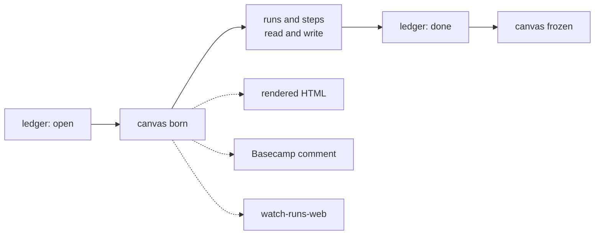

# The Canvas

2026-09-21 · Leo Figea

A canvas is a small structured document, one per task, holding the current shared understanding between a person and the agents working on it. It is edited one node at a time, never rewritten, and every change carries the reason for it. Nothing here is built yet — this spec exists to be argued with.

## The problem

The state of a task's decisions lives in a conversation, and a conversation is a log, not a state. Nobody reads it back, so the agent re-derives the current picture from scratch every turn — differently each time.

Three failures, all of them ones we have hit:

| What happens | Why |
| --- | --- |
| A position agreed early gets quietly re-litigated later | The transcript still states the old position with full confidence, and nothing marks it dead |
| An agent asked to change one thing rewrites the whole document and erases hand edits | Its only writing move is "emit the document again" |
| A decision reverses itself weeks later | The reason it was taken in the first place was never written down anywhere |

The cost is not wasted turns. It is that nobody can say, at any given moment, what we currently believe about a task.

## What a canvas is

A blackboard: the thing two colleagues stand in front of, showing the state of the world as both of them currently hold it. One per task. Both the person and the agents read it and write to it.

It holds what the problem is, what we decided, what is still open, and what we ruled out and why. It is not the conversation and it is not a summary of the conversation — it is the current answer, maintained as we go.

The orchestrator already has the same idea on a different axis:

| | answers | refuses to answer dishonestly |
| --- | --- | --- |
| **Ledger row** | Where is this task — framed, executing, blocked, done | A task cannot reach done without evidence |
| **Canvas** | What do we currently think about this task | An edit cannot land without a reason |

The ledger is the projection of a task's lifecycle. The canvas is the projection of its content.

## The four rules

Everything else is detail. These four are what make it different from a shared document.

**1. One edit is one node.** The canvas is a tree of identified nodes, and an edit names exactly one. A command that would touch two is refused. This is not a guideline the agent is asked to follow — a full rewrite is not something the tool can express, so no amount of drift produces one.

**2. Every edit carries a reason.** Required, no default. A node's reasons are its history, so before changing something you can ask what the current text was *for*, and either honour that or explicitly retire it. This is what stops a decision quietly reversing itself.

**3. A writer declares what it last read.** If that node moved since, the write is refused and the writer gets the diff. If something else moved, the write lands and the writer is told what changed while it was not looking. That is how an agent working from a ten-minute-old read finds out you edited the thing by hand.

**4. Doubt is content.** An open question is an ordinary node and sits on the board until something replaces it. A comparison of two options is just a table. Nothing forces a premature decision, which matters because models are eager to resolve.

There are four verbs — replace, insert, remove, move — and no more. A table of options becoming a settled decision is a `replace` on the table, with the reason "chose A over B: B needs a migration we are not paying for this cycle". The meaning lives in the reason, where it can be anything, rather than in a verb name, where it can only be what somebody thought of in advance.

## What it is not

- **Not a wiki.** A wiki accumulates. A canvas resolves — options collapse into decisions as the work proceeds, and it stays small enough to read in a minute and cheap enough to put in every prompt.
- **Not a transcript or a summary of one.** It holds the current answer, not the path to it. The path is in the history, one command away, marked dead.
- **Not a ticket.** The Basecamp todo and the ledger row still do their jobs. The canvas holds what we think, not where the work is.
- **Not a merge system.** It refuses conflicting writes rather than reconciling them. That is deliberate: the refusal is the feature, and it is why collaborative-editing technology does not solve this.

It is also not a UI project. The stored form is a small structured text file in the workspace — diffable, greppable, reviewable. Everything visual is a one-way rendering of that file.

## Where it fits

**One canvas per ledger row.** Not per run, not per step. A row can have several runs, including ones that died, and the canvas has to survive that and accumulate across the second and third attempt. If it belonged to the run, every restart would lose the shared picture — the exact thing it exists to stop. Runs and steps are writers; they never own it.

Solid arrows are the lifecycle; dotted ones are projections, which are one-way and never edited.

The canvas is born at `open`, where the ledger already requires a problem and an expected value — those become its first two nodes. It grows through `executing`. At `done` it freezes, and the structured artifact the done gate already demands becomes one more projection of it.

**The end state is that a step's prompt carries the canvas instead of the Basecamp task.** That is the highest-value use and the hardest constraint: it puts a size budget on the canvas that has nothing to do with human readability, and it means a badly maintained canvas actively misleads every worker rather than being a stale document nobody reads. It also decouples us from Basecamp, which becomes a place the rendered canvas is posted rather than a place work is defined.

## Does this already exist

We surveyed it before committing to build — agent/human canvas products, block-addressable document stores, structured-editing stacks, agent patch-edit protocols, spec-driven-development tooling, and modern blackboard implementations.

**Nothing has all three of the load-bearing rules.** The stale-write refusal is solved twice and solved well. Single-node editing is served once, and by nobody as an *inexpressible* rewrite. A mandatory reason per edit is implemented essentially nowhere.

| Closest thing | What it has | Why we cannot use it |
| --- | --- | --- |
| Claude Docs (Anthropic, beta) | Per-block ids and hashes, mandatory guards, a hard refusal that hands back current state | Hosted, no API, no self-host, no filesystem path, no git — and no reason field |
| Google Docs `WriteControl` | The cleanest published stale-write design in existence, stable since 2018 | Character ranges, not node identity — which actively pushes an agent toward delete-and-rewrite |
| IWE | The best shipped answer to "stop an agent touching two things" | No stale-write check and no reason — two of our three rules |
| en-quire | Git-native, with per-section history via `git log -L`. Closest architectural sibling | Addresses sections by heading text, so the first rename detaches a node from its own history |

The instructive finding: three separate 2026 projects built a correct stale-write check and then shipped a whole-document rewrite verb next to it. Making the rewrite unavailable is the part everybody skips.

The other one worth knowing: **Anytype deleted its `replaceBlock` operation because small models used it to silently wipe content.** Somebody already ran our experiment, with evals, and removed a verb over it.

**Verdict: build, and build small.** The adoptable candidates are all 2026-vintage, all under fifty stars, and each is missing two of the three rules. Taking a v0.0.0 dependency for the store that holds a task's decisions is worse than a few hundred lines of Python over git.

## The build path

Each step is useful on its own, and each one proves something before the next is worth starting. The risky step is last on purpose.

| # | Step | What it proves |
| --- | --- | --- |
| 1 | `bin/canvas` — the file, four verbs, required reason, one node per commit, stale-write refusal. No renderer, no UI | That a person keeps a canvas up to date when nothing forces them to — and that a model writes a useful reason |
| 2 | The renderer — structured file in, HTML out, linked from the ledger row | That it is worth looking at |
| 3 | The canvas in step prompts — steps read it and write to it | That it can replace the Basecamp task as the thing work is defined by |
| 4 | A read-only tab in `watch-runs-web` | That it is the thing you check to see where a task stands |
| 5 | Editing in that tab | — |
| 6 | The coherence check, writing its findings back as open-question nodes | — |

Steps 1 to 3 are the product. Steps 4 to 6 are what make it pleasant, and none of them are worth starting until step 1 has run on a real task long enough to know whether the discipline survives contact.

Four things we will copy rather than invent: IWE's error surface (a refusal names every node it matched and how to narrow), Google Docs' two-branch stale-write split, Anytype's deleted verb as evidence for rule 1, and RFC 6902's per-path precondition if commit-level granularity proves too coarse.

## Risks and open decisions

| Risk | Why it matters | Where it lands |
| --- | --- | --- |
| A model may write a useless reason | No product anywhere shipped a mandatory reason field, so there was no evidence either way. Per-node history is what the whole design rests on | **Answered.** Tested in step 1 as planned: fifty real reasons graded in [docs/why-verdict/VERDICT.md](docs/why-verdict/VERDICT.md), 41 of 50 meet the bar, and the reason stays free text |
| Node identity breaks on restructure | Ids must be stable for history to mean anything, and a restructure is exactly when somebody renumbers. en-quire shipped without solving this and its history silently attaches to the wrong text | **Settled 2026-09-23 in [node identity](node-identity.md) — decided, remainder included.** Minting, preservation under each of the four verbs, `v` bumping and what happens to a container's children are its sections 1 to 5; section 7 rules that a node's lineage ends at the retired id and that the pointer across a merge or a split lives in the `--why` of the edit that made it; section 8 rules that a restructure is never atomic. What remains open is that document's third still-open item: nothing here ages |
| The canvas drifts from reality | It says we chose A; the branch implements B. Reading the canvas cannot catch this, and it is dangerous precisely because the canvas is what you steer by | Not solved. Convention only: a reason should name its evidence |
| The closed node vocabulary grows | A fixed list of node types is a topology, and topologies fall through — the same failure we already have in how step failures are categorised | Tripwire: the day somebody proposes a "decision" or "risk" node type, the taxonomy has started growing |
| Nobody maintains it | A stale canvas injected into every prompt is worse than no canvas, because it misleads with authority | The reason step 1 is driven by hand on a real task before step 2 |

**Already decided — not reopening these.** The canvas replaces the Basecamp task as the input a step works from. It is editable in `watch-runs-web`, which means that page becomes a writer and its stated read-only invariant has to be updated honestly rather than quietly falsified. The agent commits edits directly; there is no propose-and-approve step, because provenance is what makes that safe.

**Genuinely open — all three have since been answered.** They are kept here and marked rather than deleted, so that a reader who was told they were open is told by the same place that they are not, and each names what settled it and where to read it:

- [x] Should a step be required to write to the canvas, or is an untouched canvas after a run a legitimate outcome the sweep should flag? — **Settled 2026-09-23: it must not be required to.** An untouched canvas is a legitimate outcome, and the sweep flags it rather than the tool forbidding it. The unit is the ledger row, not the step: a row that stalls gains one clause on its reason, `executing with no activity for 3h — canvas never written by any run`. Section 2 of [`ledger-orchestrator/docs/canvas-in-prompts.md`](https://github.com/malkovro/ledger-orchestrator/blob/main/docs/canvas-in-prompts.md).
- [x] What the size budget actually is, once it goes into every prompt — **Settled 2026-09-23: 20,000 characters** of the canvas document as `bin/canvas read` prints it, about 4,800 tokens at the ratio measured on real canvases. `BUDGET_CHARS` in `orchestrator/canvas.py` is the only place the number is written down. A canvas over the budget goes into the prompt whole, with a notice that makes resolving it the step's first work — nothing pruned, summarised or truncated. Section 1 of the [same document](https://github.com/malkovro/ledger-orchestrator/blob/main/docs/canvas-in-prompts.md).
- [x] Whether the renderer draws diagrams from a textual source or only passes inline SVG through — SVG diffs badly, a textual source needs a drawing step the tool would own — **Settled 2026-09-23 in [rendering.md](rendering.md) section 1: the stored text, verbatim, in a monospaced block.** No drawing step, no toolchain and no new dependency; and there is no inline SVG to pass through, because the grammar admits a textual source in a `<figure>` and taking the other side is a schema v2 change. Implemented at `canvas/render.py:206`.

Of the two hard unknowns — both since answered — node identity across a restructure is in the table above rather than here because it is a design problem rather than a decision, and that row says what settled it and what its remainder is. The other — whether a model writes a useful reason — was an experiment, and the experiment has since been run: fifty real reasons graded, 41 of them meeting the bar, in [docs/why-verdict/VERDICT.md](docs/why-verdict/VERDICT.md).

The full [engineering spec](engineering-spec.md), with the storage format, verb semantics, and node vocabulary, is canonical in this repository.
